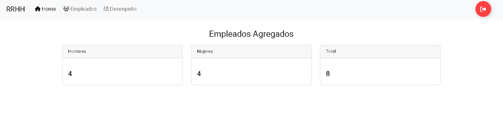
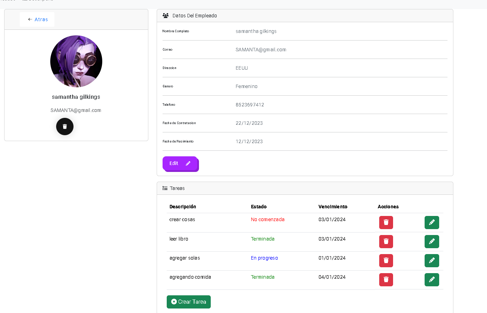
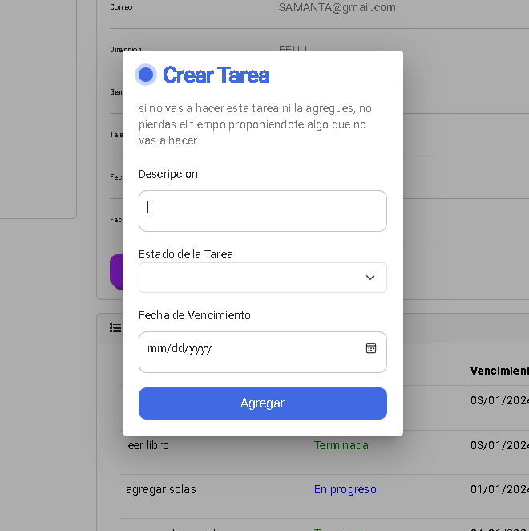
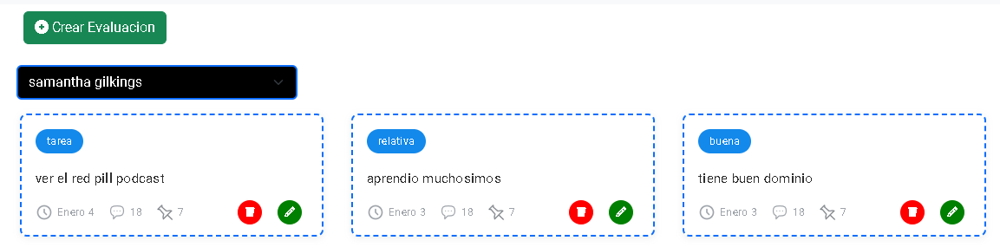
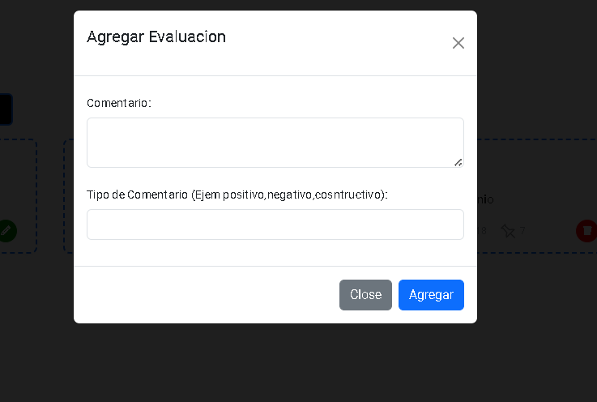

# Sistema De Recursos Humanos

## En que se Basa?

Este es un proyecto hecho con NET y Angular, este sistema simula lo que es la administracion de empleados desde el punto de vista de una persona de RRHH, entonces el sistema tiene las siguientes funcionalidades :

## Dashboard:
aqui simplemente se ve la cantidad de empleados que hay por genero y el total

## Empleados:
Aqui se ve a los empleados agregados, la imagen que tienen los empleados son por defecto si es hombre tiene una respectiva foto y las mujeres otra

## Detalle de un empleado:
en esta vista se puede la informacion de los empleados mas
detalladamente y las tareas que tienen pendientes, aqui se ve el boton de agregar tarea y al presionarlo sale el componente de agregar tarea

## Agregar Tarea a empleado:
aqui se ve el componente para agregar las tareas al empleado

## Vista De Rendimiento:
en esta vista se ve el Rendimiento de los empleados en base al empleado que seleccionemos en el select

## Empleado Selecionado:

## Agregar Rendimiento:

